<div align="center">
  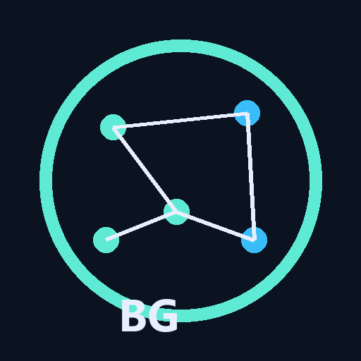

  <h1>BehaviorGraph</h1>

  <p><strong>Eventos de uso em jornadas, funis, cohorts, fricções e sinais de adoção.</strong></p>
  <p><strong>Turn product events into journeys, funnels, cohorts, friction and adoption signals.</strong></p>

  <p>
    <a href="https://barujafe1.github.io/BehaviorGraph/"><strong>🌐 Live Demo</strong></a> •
    <a href="#-visão-geral--overview">PT-BR / English Overview</a> •
    <a href="#-product-preview">Preview</a> •
    <a href="#-screenshots">Screenshots</a> •
    <a href="#-stack--tecnologias">Stack</a> •
    <a href="#-arquitetura--architecture">Architecture</a> •
    <a href="#-quick-start--início-rápido">Quick Start</a> •
    <a href="#-autor--author">Author</a>
  </p>

  <p>
    
    
    
    
    
    
    
  </p>
</div>

<p align="center">
  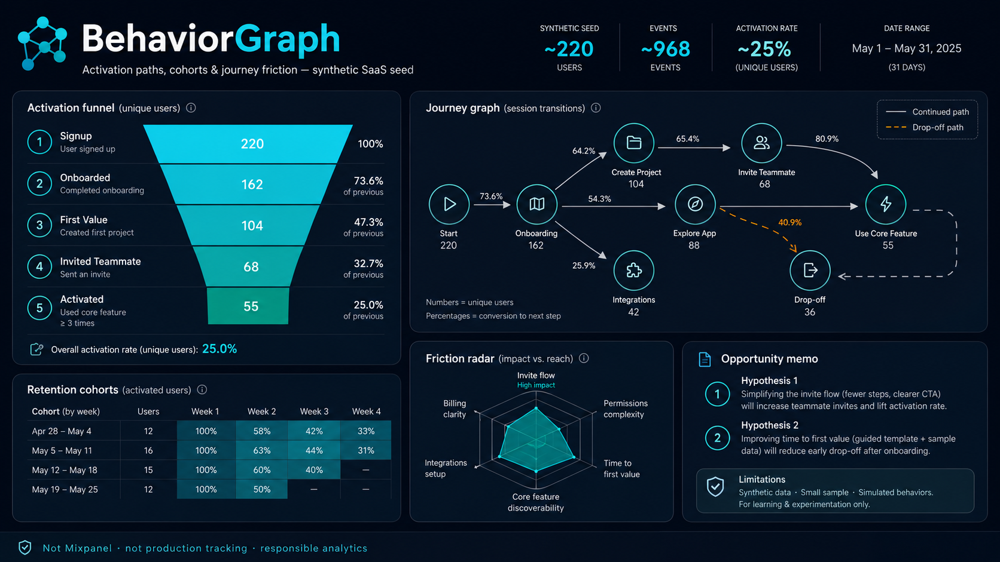
</p>

---

## 1. Visão Geral / Overview

O **BehaviorGraph** é um produto de behavioral analytics criado para transformar eventos de uso em **jornadas, segmentos, fricções, cohorts e sinais de adoção**.

Ele existe para responder não apenas *“quantos usuários converteram?”*, mas *“quais caminhos levam à ativação, abandono ou uso recorrente?”*. Em vez de tratar tracking como log bruto, o BehaviorGraph organiza taxonomia, funil de ativação, retenção, grafo de caminhos e um memo de oportunidade de produto.

O projeto foi desenvolvido por **Felipe Alirio Baruja** como peça de portfólio, conectando product analytics, instrumentação e narrativa de decisão de produto.

> **Responsible Product Analytics Notice**  
> O BehaviorGraph usa dataset sintético no MVP. Ele **não** deve ser tratado como telemetria de produção, atribuição causal automática ou substituto de suites completas de product analytics.

### 🌐 Live Demo

**Demo pública (lab):** [https://barujafe1.github.io/BehaviorGraph/](https://barujafe1.github.io/BehaviorGraph/)

A demo é **frontend-only** com snapshot sintético embutido (taxonomia, funil, cohorts, journey graph, friction e opportunity memo). O projeto Vercel `behaviorgraph` já está linkado para produção quando a cota diária resetar (`https://behaviorgraph.vercel.app`). O FastAPI local continua disponível para o fluxo full-stack via `start.bat`.

---

## ✨ Product Preview

<p align="center">
  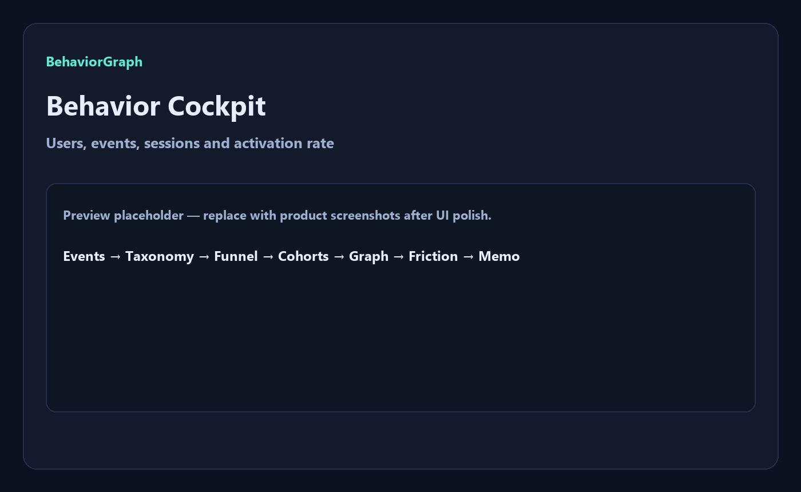
</p>

O BehaviorGraph apresenta uma experiência de mapa comportamental: cockpit de ativação, taxonomia de eventos, funil, cohorts, journey graph, friction radar e opportunity memo.

---

## 2. Por que este projeto importa? / Why this project matters

* **Eventos sem narrativa não viram decisão:** times coletam tracking, mas não traduzem o rastro em caminhos de ativação e abandono.
* **Conversão sozinha é métrica rasa:** o valor está em entender *quais sequências* levam a hábito ou churn precoce.
* **Taxonomia é contrato de produto:** sem ownership de eventos, funis e cohorts mentem com elegância.
* **Produto full-stack, não notebook:** FastAPI + Next.js com fluxo ponta a ponta para demo e entrevista.

---

## 🧠 O diferencial do BehaviorGraph / What makes BehaviorGraph different

### Português
O BehaviorGraph não é um dashboard genérico de métricas. Ele combina taxonomia, funil de ativação, cohorts, grafo de jornada e fricção em uma experiência de product analytics.

Ele mostra não apenas o volume de eventos, mas também:
- quais passos da ativação perdem usuários;
- quais transições dominam as sessões;
- quais segmentos merecem atenção (activated / at-risk / power);
- onde a fricção aparece no caminho;
- quais hipóteses de produto fazem sentido — e quais limites impedem overclaim.

### English
BehaviorGraph is not a generic metrics dashboard. It combines taxonomy, activation funnel, cohorts, journey graph and friction into one product-analytics experience.

It shows not only event volume, but also:
- which activation steps lose users;
- which transitions dominate sessions;
- which segments deserve attention (activated / at-risk / power);
- where friction appears on the path;
- which product hypotheses make sense — and which limits block overclaiming.

---

## 🎯 Problema que resolve / The problem it solves

Em produtos digitais, equipes costumam sofrer com:
- eventos coletados sem taxonomia clara;
- funis baseados em contagem bruta em vez de usuários únicos;
- ausência de leitura de jornada (path);
- cohorts frágeis ou mal definidos;
- fricção invisível até o churn já ter acontecido;
- relatórios que mostram “quantos”, mas não “por qual caminho”.

O **BehaviorGraph** cria uma camada interpretável entre o evento bruto e a decisão de produto.

---

## 🧩 Proposta / Analytical Pipeline

O BehaviorGraph processa eventos sintéticos (MVP) e entrega uma visão estruturada de ativação, retenção, caminhos e oportunidades:

```txt
Synthetic Event Stream / Demo Dataset
  ↓
Event taxonomy validation
  ↓
Activation funnel (unique users)
  ↓
Retention cohorts (week-based)
  ↓
Journey path graph (NetworkX transitions)
  ↓
Segmentation (activated / at-risk / power)
  ↓
Friction radar (drops + error-like events)
  ↓
Product opportunity memo
```

---

## 📸 Screenshots

<table>
  <tr>
    <td width="50%">
      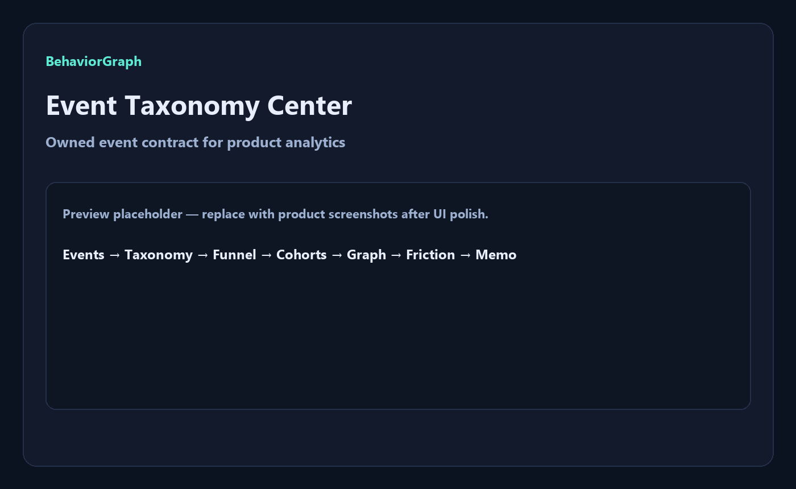
      <br />
      <sub><strong>Event Taxonomy Center</strong> — owned event contract, categories and product ownership.</sub>
    </td>
    <td width="50%">
      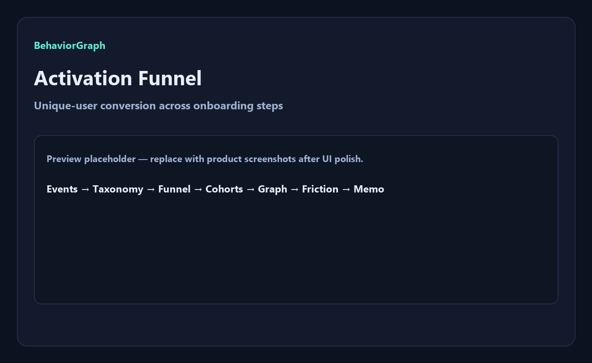
      <br />
      <sub><strong>Activation Funnel</strong> — unique-user conversion across onboarding steps.</sub>
    </td>
  </tr>
  <tr>
    <td width="50%">
      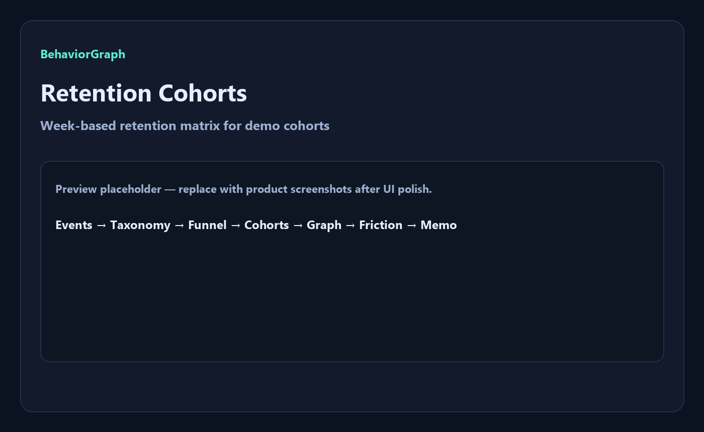
      <br />
      <sub><strong>Retention Cohorts</strong> — week-based retention matrix for demo cohorts.</sub>
    </td>
    <td width="50%">
      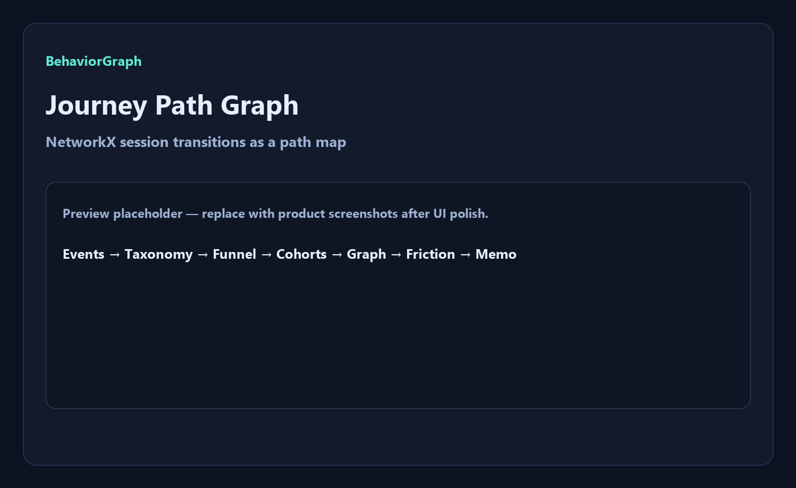
      <br />
      <sub><strong>Journey Path Graph</strong> — NetworkX session transitions as a behavioral map.</sub>
    </td>
  </tr>
  <tr>
    <td width="50%">
      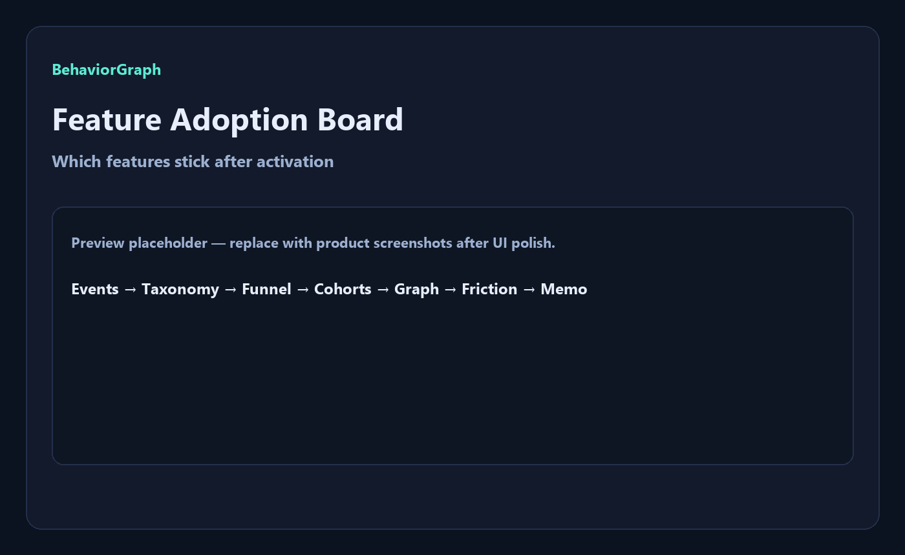
      <br />
      <sub><strong>Feature Adoption Board</strong> — which features stick after activation.</sub>
    </td>
    <td width="50%">
      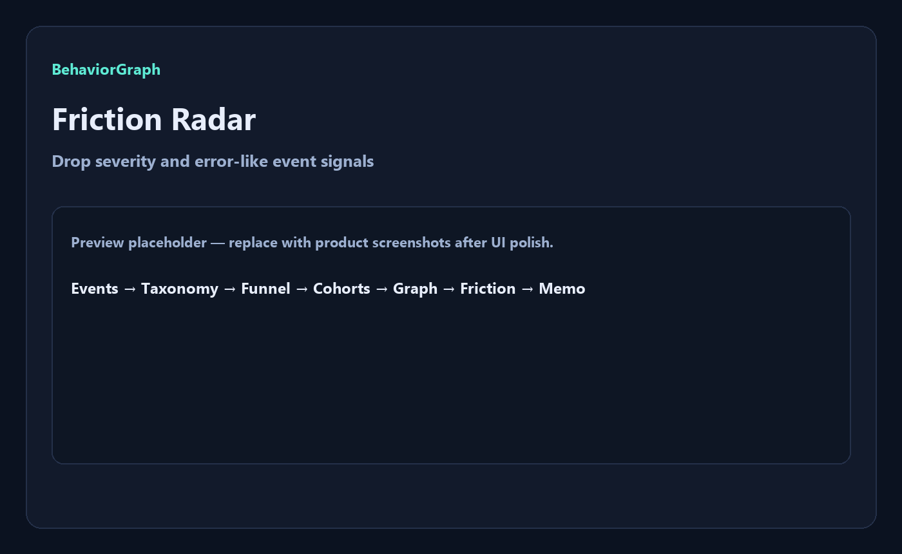
      <br />
      <sub><strong>Friction Radar</strong> — drop severity and error-like event signals.</sub>
    </td>
  </tr>
</table>

---

## 📄 Product Opportunity Memo

<p align="center">
  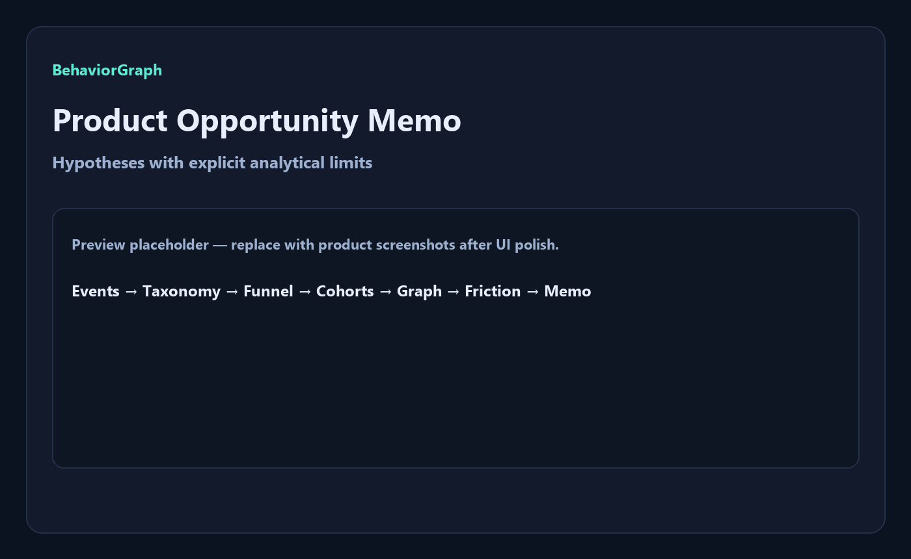
</p>

O memo consolida drops do funil, hipóteses de produto, ações sugeridas e limitações explícitas — pronto para discussão de discovery e priorização.

---

## 📌 Estudo de Caso / Case Study

### 📌 Estudo de Caso: Onboarding SaaS Sintético
O dataset demo simula onboarding de um SaaS com ~220 usuários, milhares de eventos e sessões com signup, onboarding, feature use, ativação, abandono e retorno. O BehaviorGraph monta o funil de ativação, cohorts semanais, grafo de transições e um radar de fricção.

A leitura é exploratória e orientada a produto: drops entre passos, segmentos at-risk e hipóteses de melhoria de instrumentação/UX — sem pretender atribuição causal automática.

### 📌 Case Study: Synthetic SaaS Onboarding
The demo dataset simulates SaaS onboarding with ~220 users, thousands of events and sessions covering signup, onboarding, feature use, activation, abandonment and return visits. BehaviorGraph builds the activation funnel, weekly cohorts, transition graph and a friction radar.

The reading is exploratory and product-oriented: step drops, at-risk segments and instrumentation/UX hypotheses — without claiming automatic causal attribution.

---

## 🧭 Visual Story / Jornada Analítica

A experiência do BehaviorGraph foi pensada como uma jornada de product analytics:
```txt
1. Carregar o dataset sintético de eventos
2. Revisar a taxonomia (contrato de eventos)
3. Ler o cockpit de ativação (users / events / rate)
4. Percorrer o funil e localizar o maior drop
5. Inspecionar cohorts de retenção
6. Explorar o journey path graph
7. Segmentar activated / at-risk / power
8. Abrir o friction radar
9. Fechar com o product opportunity memo e limitações
```

---

## ⚙️ Funcionalidades Principais / Core Features

### Event Taxonomy Center
Contrato de eventos com categoria, descrição e ownership — base para funis e cohorts confiáveis.

### Activation Funnel
Funil de ativação por usuários únicos, com conversão passo a passo e leitura de drop.

### Retention Cohorts
Cohorts semanais a partir do first-seen, com retenção por offset de semana.

### Journey Path Graph
Grafo de transições de sessão construído com NetworkX para mapear caminhos frequentes.

### Segment Explorer
Segmentos iniciais: Activated, At-risk/friction e Power explorers.

### Friction Radar + Opportunity Memo
Drops priorizados, sinais de erro/abandono e hipóteses de produto com limitações explícitas.

---

## 🛠️ Stack / Tecnologias

### Frontend
- **Framework:** Next.js 15 (App Router) & React 19
- **Linguagem:** TypeScript
- **Visualização:** Recharts & React Flow (`@xyflow/react`)
- **Ícones:** Lucide Icons

### Backend / Analytics
- **Framework API:** FastAPI & Uvicorn (Python)
- **Processamento:** Pandas + NumPy
- **Grafos:** NetworkX
- **Exploração:** DuckDB (preparado no scaffold)
- **Validação:** Pydantic v2
- **Testes:** Pytest

### Infra sugerida (roadmap)
- Supabase/Postgres para persistência
- Vercel para frontend
- Endpoint de ingestão de eventos (Fase 3 / SDK)

---

## 🧱 Arquitetura / Architecture

O projeto adota um monorepo simplificado:

```text
BehaviorGraph/
├── apps/
│   ├── web/                         # Frontend Next.js (App Router)
│   │   ├── app/                     # Cockpit principal
│   │   ├── components/              # UI / charts / graph views
│   │   ├── lib/                     # API client
│   │   └── types/                   # Tipos TypeScript
│   │
│   └── api/                         # Backend FastAPI
│       ├── app/
│       │   ├── api/                 # Endpoints (/demo, /funnel, /journeys, ...)
│       │   ├── models/              # Schemas
│       │   └── services/            # Funnel, cohorts, graph, friction
│       └── tests/                   # Pytest
│
├── data/
│   └── seed/                        # events_demo.csv + event_taxonomy.csv
│
├── docs/                            # Pitch, metodologia e roadmap
├── assets/                          # Ícone, hero, architecture e screenshots
├── scripts/                         # Geração de seed e assets
├── start.bat                        # Inicializador Windows
└── README.md                        # Esta documentação
```

---

## 🧱 Visual Architecture

<p align="center">
  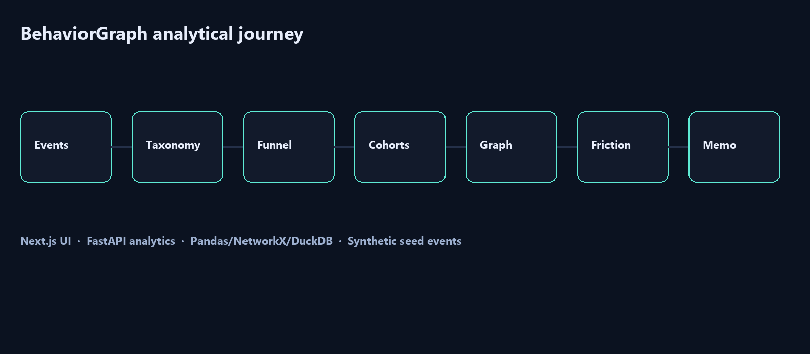
</p>

BehaviorGraph follows a traceable behavioral flow: events enter through taxonomy, become funnel/cohorts/graph insights, then surface as friction and product opportunity narrative.

---

## 🔁 Data Flow Pipeline

```txt
Raw / Synthetic Events
  ↓
Taxonomy mapping & ownership
  ↓
Activation funnel (unique users)
  ↓
Retention cohorts (first-seen week)
  ↓
Session transition graph (NetworkX)
  ↓
Segments + friction severity
  ↓
Opportunity memo (hypotheses + limits)
  ↓
Next.js cockpit
```

---

## 🚀 Quick Start / Início Rápido

### Pré-requisitos
- **Node.js** v20 ou superior
- **Python** v3.10 ou superior (preferencialmente 3.12)
- **Git**

### Opção 1 — Execução integrada no Windows
Na pasta raiz do projeto:
```bash
start.bat
```
O script cria o venv Python, instala dependências, sobe FastAPI em `:8000`, Next.js em `:3000` e abre o navegador.

### Opção 2 — Execução manual

#### 1. Backend FastAPI (`apps/api`)
```bash
cd apps/api
python -m venv .venv
.venv\Scripts\activate            # Windows
source .venv/bin/activate          # Linux/macOS
pip install -r requirements.txt
uvicorn app.main:app --reload --port 8000
```
*API em [http://127.0.0.1:8000](http://127.0.0.1:8000). Docs em `/docs`.*

#### 2. Frontend Next.js (`apps/web`)
```bash
cd apps/web
npm install
npm run dev
```
*Frontend em [http://localhost:3000](http://localhost:3000).*

#### 3. Regenerar seed / assets (opcional)
```bash
python scripts/generate_seed.py
pip install pillow
python scripts/generate_assets.py
```

---

## 🧪 Scripts e Testes / Scripts and Testing

### Backend (Pytest)
```bash
cd apps/api
.venv\Scripts\python -m pytest
```

### Frontend
```bash
cd apps/web
npm run lint
npm run typecheck
npm run build
```

---

## 📊 Metodologia / Behavioral Methodology

* **Unique-user funnel:** conversão por usuários distintos em cada passo de ativação.
* **Week cohorts:** first-seen define a cohort; retenção mede presença em semanas seguintes.
* **Path graph:** transições ordenadas por `session_id` agregadas com NetworkX.
* **Friction bands:** drops classificados por severidade (`low` / `medium` / `high`).
* **Explicit limits:** memo de oportunidade declara o que o MVP não prova (causalidade, produção, atribuição Markov).

---

## 🛡️ Escopo, Ética e Boas Práticas

* **Synthetic-first MVP:** sem tracking real de produção.
* **Sem overclaim causal:** caminhos são exploratórios.
* **Taxonomia antes de volume:** qualidade do evento > quantidade de eventos.
* **Não é clone de Mixpanel:** foco em narrativa de produto e instrumentação.

---

## 🧭 Roadmap do Produto

* **MVP:** tracker demo, dataset sintético, taxonomia, funil, cohorts, path graph, segmentos, friction, opportunity memo.
* **Fase 2:** eventos órfãos, análise de sequência, cohorts comportamentais, alertas de ativação, recomendações de instrumentação.
* **Fase 3:** SDK mínimo, ingestão near-real-time, experiment tags, app demo + assistant de perguntas de produto.
* **Não entra:** competir com Mixpanel; dashboard genérico; tracking real no MVP.

---

## 💼 Valor para Portfólio / Portfolio Value

O BehaviorGraph demonstra competências para **Product Analytics, Analytics Engineering e Product Data**:
- design de taxonomia de eventos;
- funis e cohorts com definição explícita;
- grafos de jornada e leitura de fricção;
- conexão entre evidência comportamental e decisão de produto;
- arquitetura full-stack (Next.js + FastAPI).

---

## 📚 Documentação Complementar

- [docs/portfolio_pitch.md](./docs/portfolio_pitch.md) — roteiro de entrevista e demo de 3 minutos
- [docs/technical_methodology.md](./docs/technical_methodology.md) — schema, funil, cohorts e grafo
- [docs/product_roadmap.md](./docs/product_roadmap.md) — MVP, Fase 2 e Fase 3

---

## 🖼️ GitHub Social Preview

Uma imagem para visualização social está disponível em:
```txt
assets/social-preview.png
```
*Dimensão recomendada: 1280x640, <1MB. Upload em: Repository Settings → Social Preview.*

---

## 🔖 GitHub Repository Metadata

### About sugerido
```txt
Behavioral analytics studio: event taxonomy, activation funnels, retention cohorts, journey graphs and product opportunity memos.
```

### Topics sugeridos
```txt
product-analytics
behavioral-analytics
event-tracking
activation-funnel
retention-cohorts
journey-analytics
networkx
fastapi
nextjs
typescript
python
duckdb
portfolio-project
data-visualization
```

---

## 👤 Autor / Author

Desenvolvido por **Felipe Alirio Baruja**.

- **Portfolio:** [barujafe.vercel.app](https://barujafe.vercel.app/)
- **GitHub:** [@BarujaFe1](https://github.com/BarujaFe1)
- **LinkedIn:** [Gustavo Felipe Alirio Baruja](https://www.linkedin.com/in/barujafe/)

---

## 📄 Licença / License

MIT License. Copyright (c) 2026 Felipe Alirio Baruja.
O código está disponível sob a licença MIT caso o arquivo `LICENSE` esteja presente no repositório.
