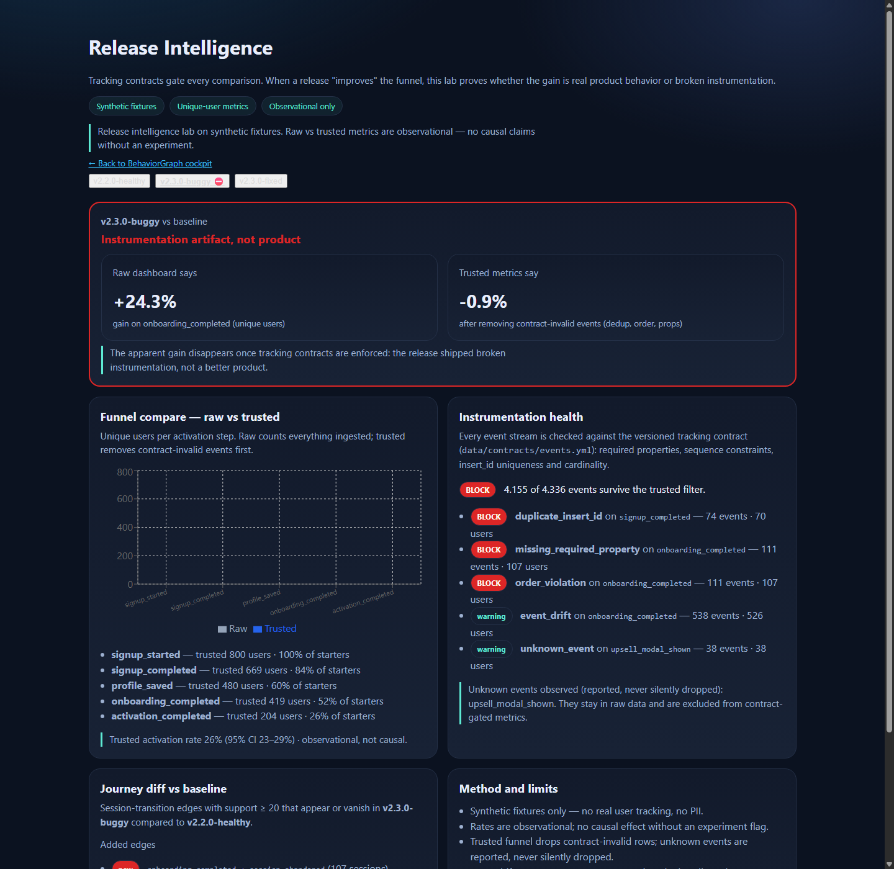
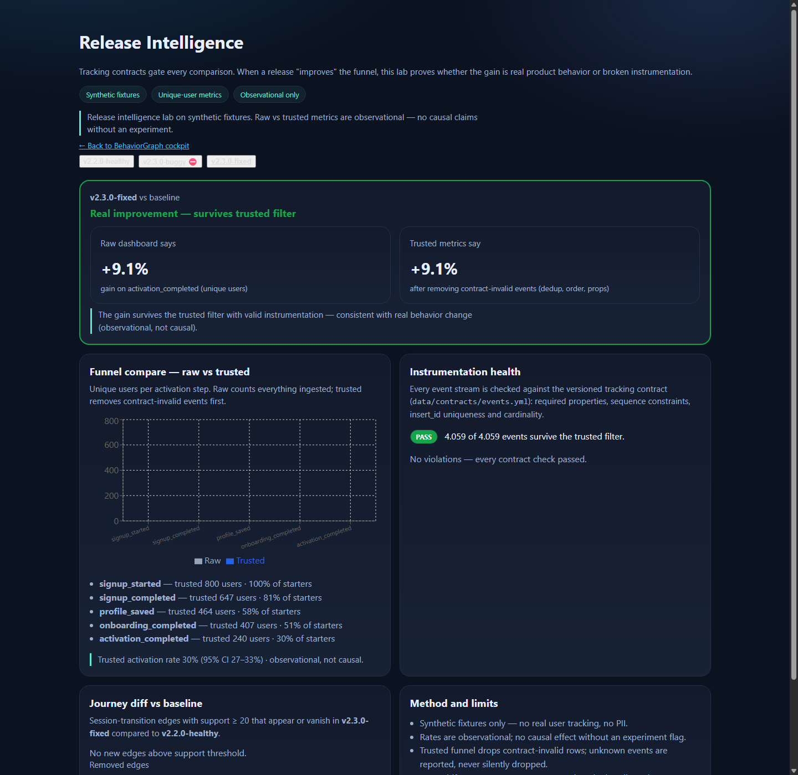

<div align="center">
  

  <h1>BehaviorGraph</h1>

  <p><strong>Estúdio de analytics comportamental — taxonomia, funis, cohorts, jornadas e memos de oportunidade.</strong></p>
  <p><strong>Behavioral analytics studio — taxonomy, funnels, cohorts, journeys and opportunity memos.</strong></p>

  <p>
    <a href="#pt-br">PT-BR</a> ·
    <a href="#en">English</a> ·
    <a href="#live-demo">Live Demo</a> ·
    <a href="#stack--tecnologias">Stack</a> ·
    <a href="#arquitetura--architecture">Architecture</a> ·
    <a href="#quick-start--início-rápido">Quick Start</a> ·
    <a href="#autor--author">Author</a>
  </p>

  <p>
    <a href="https://barujafe1.github.io/BehaviorGraph/"></a>
    
    
    
    
    
    
    
  </p>

  <p>
    <a href="https://barujafe1.github.io/BehaviorGraph/"><strong>Live Demo</strong></a> ·
    <a href="https://github.com/BarujaFe1/BehaviorGraph"><strong>Repositório</strong></a> ·
    <a href="https://barujafe.vercel.app/"><strong>Portfólio</strong></a> ·
    <a href="https://www.linkedin.com/in/barujafe/"><strong>LinkedIn</strong></a>
  </p>
</div>

<p align="center">
  
</p>

---

<a id="pt-br"></a>

## PT-BR

## Visão geral

**BehaviorGraph** conecta taxonomia de eventos, funis de ativação, cohorts de retenção, grafos de jornada e memos de oportunidade de produto em um estúdio analítico de lab.

> **Aviso de lab:** demo de portfólio com dados sintéticos. Não é produto em produção com SLA, tracking real de usuários ou atribuição causal.

| Item | Estado |
|---|---|
| Escopo | Portfolio lab / MVP (seed sintética) |
| Live Demo | [barujafe1.github.io/BehaviorGraph](https://barujafe1.github.io/BehaviorGraph/) |
| CI | GitHub Actions (API + Web) |
| Tracking de produção | **Fora do escopo** |

---

## Problema

Produtos digitais coletam eventos, mas times ainda lutam para responder:

- Quais passos de ativação perdem usuários?
- Quais transições de sessão dominam?
- Quais cohorts retêm depois da semana 0?
- Onde o atrito é alto o suficiente para merecer uma aposta de produto?

Métricas de vaidade (“quantos se cadastraram?”) escondem o caminho.

---

## Funcionalidades

- Taxonomia de eventos como contrato com owner
- Funil de ativação aninhado (usuários únicos que permanecem dos passos anteriores)
- Cohorts de retenção por primeira semana vista (offsets W0–W4 reais)
- Grafo de jornada (transições de sessão via NetworkX)
- Segmentos + radar de atrito com severidade (`low` / `medium` / `high`)
- Memo de oportunidade (ação + hipótese de impacto + limites)
- Snapshot estático para demos públicas confiáveis
- Backend FastAPI opcional para execução full-stack local

---

## Release Intelligence

Depois de uma release, o funil “melhora”. Mas foi o produto ou a instrumentação?

O lab agora valida **contratos de tracking** antes de comparar releases:

- `data/contracts/events.yml` — contrato versionado por evento (owner, props obrigatórias, ordem, cardinalidade, versão)
- Validador determinístico: missing props, order violations, duplicate `insert_id`, cardinality, unknown events e event drift
- Comparação **raw vs trusted** por usuário único com veredito explícito
- Intervalos de confiança de Wilson; linguagem estritamente observacional

Golden scenario (fixtures sintéticas determinísticas):

```text
v2.3.0-buggy  raw onboarding_completed  +24.3%  →  trusted −0.9%   ⇒ artefato de instrumentação
v2.3.0-fixed  activation_completed      +9.1%   →  trusted +9.1%   ⇒ melhora real
```

Demo: [`/releases`](https://barujafe1.github.io/BehaviorGraph/releases/) · Método: [docs/RELEASE_INTELLIGENCE_METHOD.md](./docs/RELEASE_INTELLIGENCE_METHOD.md)

<table>
  <tr>
    <td width="50%">
      
      <br /><sub><strong>v2.3.0-buggy</strong> — raw +24.3% desaparece no trusted (−0.9%): artefato de instrumentação</sub>
    </td>
    <td width="50%">
      
      <br /><sub><strong>v2.3.0-fixed</strong> — +9.1% sobrevive ao filtro trusted: melhora real</sub>
    </td>
  </tr>
</table>

---

## Escopo e limites

- **É:** estúdio lab de behavioral analytics.
- **Não é:** clone de Amplitude/Mixpanel, CDP, SDK de tracking de produção, ferramenta causal.

---

<a id="en"></a>

## English

## Overview

**BehaviorGraph** connects event taxonomy, activation funnels, retention cohorts, journey graphs and product opportunity memos in one analytics studio lab.

> **Lab notice:** portfolio demo with synthetic data only. Not production telemetry, not Mixpanel, and not causal attribution.

---

## Problem

Digital products collect events, but teams still struggle to answer:

- Which activation steps lose users?
- Which session transitions dominate?
- Which cohorts retain after week 0?
- Where is friction high enough to deserve a product bet?

Conversion vanity metrics (“how many signed up?”) hide the path.

---

## Core features

- Event taxonomy as an owned contract
- Nested unique-user activation funnel (+ conversion from start)
- Retention cohorts with true W0–W4 offsets
- Journey graph edges with weights (NetworkX)
- Segments + friction severity bands
- Opportunity memo (action + impact hypothesis + limits)
- Static lab snapshot for reliable public demos
- Optional FastAPI backend for local full-stack runs

---

## Release Intelligence

After a release, the funnel “improves”. But was it the product — or the instrumentation?

The lab now validates **tracking contracts** before comparing releases:

- `data/contracts/events.yml` — versioned per-event contract (owner, required props, sequence, cardinality, introduced-in)
- Deterministic validator: missing props, order violations, duplicate `insert_id`, cardinality, unknown events and event drift
- **Raw vs trusted** comparison on unique users with an explicit verdict
- Wilson confidence intervals; strictly observational language

Golden scenario (deterministic synthetic fixtures):

```text
v2.3.0-buggy  raw onboarding_completed  +24.3%  →  trusted −0.9%   ⇒ instrumentation artifact
v2.3.0-fixed  activation_completed      +9.1%   →  trusted +9.1%   ⇒ real improvement
```

Demo: [`/releases`](https://barujafe1.github.io/BehaviorGraph/releases/) · Method: [docs/RELEASE_INTELLIGENCE_METHOD.md](./docs/RELEASE_INTELLIGENCE_METHOD.md)

<table>
  <tr>
    <td width="50%">
      
      <br /><sub><strong>v2.3.0-buggy</strong> — raw +24.3% vanishes under trusted (−0.9%): instrumentation artifact</sub>
    </td>
    <td width="50%">
      
      <br /><sub><strong>v2.3.0-fixed</strong> — +9.1% survives the trusted filter: real improvement</sub>
    </td>
  </tr>
</table>

---

## Scope and limits

- **Is:** behavioral analytics studio lab.
- **Is not:** Amplitude/Mixpanel clone, CDP, production tracking SDK, causal tool.

---

<a id="live-demo"></a>

## Live Demo

**URL:** [https://barujafe1.github.io/BehaviorGraph/](https://barujafe1.github.io/BehaviorGraph/)

Demo hospedada para avaliação de portfólio / Hosted for portfolio review.

> Lab demo — synthetic data only. Not a production SLA product.

---

## Screenshots

<table>
  <tr>
    <td width="50%">
      
      <br /><sub><strong>Activation Funnel</strong> — nested unique-user conversion</sub>
    </td>
    <td width="50%">
      
      <br /><sub><strong>Retention Cohorts</strong> — first-seen week matrix</sub>
    </td>
  </tr>
  <tr>
    <td width="50%">
      
      <br /><sub><strong>Journey Graph</strong> — session transitions</sub>
    </td>
    <td width="50%">
      
      <br /><sub><strong>Opportunity Memo</strong> — hypotheses + limits</sub>
    </td>
  </tr>
</table>

---

<a id="stack--tecnologias"></a>

## Stack / Tecnologias

| Tecnologia | Uso no projeto |
|---|---|
| Next.js 15 / React 19 / TypeScript | UI + export estático |
| Recharts | Charts |
| FastAPI / Pydantic v2 / Pandas / NetworkX | Analytics API |
| Pytest / Ruff / ESLint / tsc / GitHub Actions | Qualidade |

---

<a id="arquitetura--architecture"></a>

## Arquitetura / Architecture

```text
CSV seed → FastAPI analytics (Pandas/NetworkX/Pydantic)
                 ↓
         demo-snapshot.json (static)
                 ↓
     Next.js cockpit (Recharts)
```

Details: [docs/ARCHITECTURE.md](./docs/ARCHITECTURE.md) · decisions: [docs/TECHNICAL_DECISIONS.md](./docs/TECHNICAL_DECISIONS.md)

<p align="center">
  
</p>

---

<a id="quick-start--início-rápido"></a>

## Quick Start / Início rápido

### Pré-requisitos / Requirements

- Node.js 20+
- Python 3.12+
- npm

### Windows (atalho)

```bat
start.bat
```

Sobe API em :8000 e web em :3000.

### Static web lab only

```bash
cd apps/web
npm install
npm run dev
```

Open [http://localhost:3000](http://localhost:3000) — uses embedded snapshot (no API required).

### Full-stack manual

```bash
# API
cd apps/api
python -m venv .venv
# Windows: .venv\Scripts\activate
# macOS/Linux: source .venv/bin/activate
pip install -r requirements.txt
uvicorn app.main:app --reload --port 8000

# Web (outro terminal / another terminal)
cd apps/web
npm install
npm run dev
```

Abra http://localhost:3000

### Environment variables

See [`.env.example`](./.env.example) and [`apps/web/.env.example`](./apps/web/.env.example).

| Variable | Purpose |
|---|---|
| `NEXT_PUBLIC_API_URL` | Optional FastAPI base URL; empty = snapshot lab mode |
| `GITHUB_PAGES=true` | Adds `/BehaviorGraph` basePath for Pages builds |

Never commit `.env.local` or secrets. See [SECURITY_NOTES.md](./SECURITY_NOTES.md).

---

## Tests & quality

```bash
# API
cd apps/api
.venv\Scripts\python -m pytest -q
.venv\Scripts\ruff check app tests

# Web
cd apps/web
npm run lint
npm run typecheck
npm run build
```

More: [docs/TESTING.md](./docs/TESTING.md) · Deploy: [docs/DEPLOYMENT.md](./docs/DEPLOYMENT.md)

---

## Trade-offs

| Choice | Gain | Cost |
|---|---|---|
| Static snapshot demo | Reliable public URL | Must regenerate after analytics changes |
| Nested funnel | Honest drop-offs | Stricter than independent counts |
| Transition graph | Clear journey story | Not attribution / not causal |
| Lab scope | Portfolio clarity | Not a full product-analytics suite |

---

## Roadmap

- **MVP (done):** taxonomy, nested funnel, cohorts, graph, friction, memo, static demo, CI
- **Phase 2 (done):** release intelligence — tracking contracts, instrumentation validator, raw vs trusted funnel comparison per release
- **Phase 3 (planned):** minimal SDK, near-real-time ingest, experiment tags

Non-goals: Mixpanel clone, generic metrics dashboard, production tracking.

---

## What this project demonstrates

- Product analytics thinking (instrumentation → narrative → decision)
- Correct funnel/cohort definitions (not vanity charts)
- Full-stack delivery (FastAPI + Next.js) with a resilient static demo mode
- Responsible analytics communication (limits stated in UI + docs)
- Engineering hygiene (Pydantic contracts, tests, CI, deploy docs)

Pitch notes: [docs/portfolio_pitch.md](./docs/portfolio_pitch.md)

---

<a id="autor--author"></a>

## Autor / Author

Developed by **Felipe Alirio Baruja**.

- **Portfolio:** [https://barujafe.vercel.app/](https://barujafe.vercel.app/)
- **GitHub:** [github.com/BarujaFe1](https://github.com/BarujaFe1)
- **LinkedIn:** [linkedin.com/in/barujafe](https://www.linkedin.com/in/barujafe/)
- **Repository:** [github.com/BarujaFe1/BehaviorGraph](https://github.com/BarujaFe1/BehaviorGraph)

---

## License / Licença

MIT License © 2026 Felipe Alirio Baruja.

See [LICENSE](./LICENSE) for details.

---

<div align="center">
  <p><strong>BehaviorGraph</strong></p>
  <p>De eventos brutos a oportunidades de produto.</p>
  <p><em>From raw events to product opportunities.</em></p>
</div>
